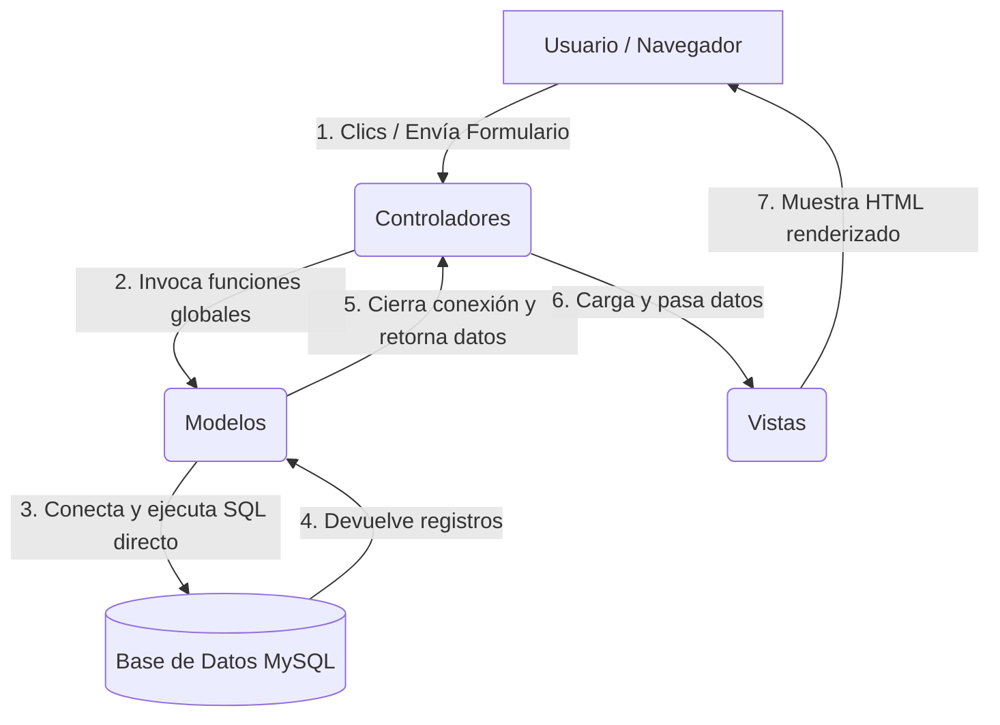

# MANUAL COMPLETO DE FUNCIONAMIENTO Y ARQUITECTURA - PROYECTO MANADAS
*(Guía Unificada de Estudio y Defensa de Proyecto)*

Este documento unifica y reemplaza todos los manuales de arquitectura y funcionamiento anteriores. Explica en detalle el comportamiento, la estructura procedimental simplificada y las decisiones de diseño del sistema **Manadas (MisAnimalitos)**. Está diseñado para servir como material de estudio definitivo para la defensa del proyecto.

---

## 1. ¿Qué es y qué hace el sistema "Manadas"?
El sistema **Manadas** es una plataforma web desarrollada en **PHP y MySQL** que actúa como nexo de conexión entre tres roles de usuario claramente diferenciados:

1. **Dueños de Mascotas (Usuarios/Clientes):**
   * Crean su cuenta a través de la pantalla de registro de clientes.
   * Registran sus mascotas (perros) detallando nombre, raza, tamaño y observaciones.
   * Reservan paseos (individuales o grupales) indicando la fecha, la hora de inicio y eligiendo su paseador de preferencia.
   * Visualizan su historial de reservas, controlando el estado de sus paseos y pagos.
2. **Paseadores (Prestadores de Servicio/Empleados):**
   * Acceden a su panel de control con estadísticas rápidas sobre su jornada.
   * Consultan su agenda diaria de paseos (solo se muestran los paseos ya abonados y habilitados por el administrador).
   * Visualizan detalles clave como la dirección del dueño, teléfono de contacto, nombre del perro y notas sobre su temperamento (alerta de comportamiento).
   * Controlan el inicio y fin de cada paseo en tiempo real mediante botones interactivos ("Comenzar Paseo" -> "Finalizar Paseo").
3. **Administrador (Admin):**
   * Supervisa las estadísticas globales de la plataforma.
   * Gestiona y registra las cuentas de nuevos paseadores.
   * Revisa el listado global de paseos e historial de pagos.
   * Confirma los pagos recibidos (efectivo, transferencia, tarjeta) y habilita automáticamente los paseos para que aparezcan en la agenda de los paseadores.

---

## 2. Arquitectura de Software: Estructura Procedimental Simplificada
Para facilitar el aprendizaje y adecuarse a un nivel inicial de programación y bases de datos, el proyecto se organiza bajo una estructura **MVC (Modelo-Vista-Controlador) Procedimental/Estructurada**, prescindiendo de la Programación Orientada a Objetos (POO) compleja y de clases:



* **Modelo (Models) - Carpeta `models/`:**
  Contiene funciones procedimentales globales (sin encapsular en clases) que agrupan las consultas SQL (`SELECT`, `INSERT`, `UPDATE`). Cada función es autónoma: abre la conexión a la base de datos, ejecuta la consulta, la cierra y retorna el resultado (evitando fugas de memoria o conexiones huérfanas).
* **Vista (Views) - Carpeta `views/`:**
  Representa el diseño gráfico en HTML y CSS. Utiliza bloques mínimos de PHP (`if`, `foreach`) únicamente para imprimir los datos enviados por el controlador.
* **Controlador (Controllers) - Carpeta `controllers/`:**
  Son scripts estructurados que actúan como "cerebros". Leen el parámetro `action` de la URL, procesan la lógica inicial, invocan a las funciones globales de los modelos y cargan la vista correspondiente.

### Estructura de Directorios del Proyecto:
```text
MisAnimalitos/
├── config/                  <-- Configuraciones maestras del sistema
│   ├── conexion.php         (Abre y cierra el enlace con MySQL usando la librería mysqli)
│   ├── config.php           (Define la constante BASE_URL de manera dinámica)
│   └── sesion.php           (Maneja el inicio de sesión y validaciones de seguridad de $_SESSION)
│
├── controllers/             <-- Los controladores estructurados
│   ├── AdminController.php  (Lógica de estadísticas, creación de paseadores y pagos)
│   ├── AuthController.php   (Lógica de login, logout y registro de clientes)
│   ├── PaseadorController.php(Lógica de la agenda del paseador)
│   └── UsuarioController.php (Lógica de mascotas y solicitud de paseos del dueño)
│
├── models/                  <-- Los modelos procedimentales (funciones globales y SQL directo)
│   ├── AdminModel.php       (Consultas y transacciones de administración)
│   ├── AuthModel.php        (Autenticación, chequeo de emails y registro de usuarios)
│   ├── PaseadorModel.php    (Consultas de agenda y actualización de estados del paseo)
│   └── UsuarioModel.php     (Consultas de mascotas, historial y solicitud de paseos)
│
├── views/                   <-- La interfaz gráfica de usuario
│   ├── admin/               (Pantallas exclusivas del Administrador)
│   ├── paseador/            (Pantallas y agenda interactiva del Paseador)
│   ├── usuario/             (Catálogo de mascotas y reservas del Dueño)
│   ├── partials/            (header.php y footer.php comunes para estructurar el diseño)
│   ├── login.php            (Pantalla de inicio de sesión)
│   └── registro.php         (Pantalla de registro de nuevos clientes)
│
├── Assets/                  <-- Archivos estáticos
│   ├── css/                 (new-style.css, hojas de estilo premium de la plataforma)
│   └── img/                 (Imágenes de fondo, logotipos y fotos de perfil)
│
├── index.php                <-- Redirección automática inicial al login
└── manadas.sql              <-- Estructura e inserciones base de la base de datos
```

---

## 3. Flujos de Trabajo Explicados Paso a Paso

### A. Flujo de Inicio de Sesión (Login)
1. El usuario ingresa a `views/login.php` y completa su Email y Contraseña.
2. Al presionar "Ingresar", el formulario envía los datos vía **POST** a `controllers/AuthController.php?action=login`.
3. El controlador limpia los espacios del email con `trim()` y valida que los campos no estén vacíos.
4. Llama a la función global `autenticarUsuario($email, $password)`.
5. La función busca secuencialmente el correo en las tablas `admin`, `paseador` y `usuarios` (clientes) mediante consultas directas.
6. Si encuentra coincidencia, comprueba la contraseña usando `password_verify()` (compatible con hashes de bcrypt o texto plano de prueba).
7. Si es exitoso, el controlador guarda los datos en la memoria del servidor (`$_SESSION`) llamando a `crearSesion()`.
8. Finalmente, redirige al usuario a su panel correspondiente según su rol (Admin, Paseador o Dueño).

### B. Flujo de Registro de Clientes (Dueño de Mascotas)
1. El usuario hace clic en "Crea una cuenta" en el login, cargando la pantalla [registro.php](file:///c:/xampp/htdocs/MisAnimalitos/views/registro.php).
2. Completa sus datos personales y envía el formulario por POST a `controllers/AuthController.php?action=register`.
3. El controlador valida los datos obligatorios e invoca a `emailExiste($email)`.
4. La función `emailExiste` recorre las tres tablas de la base de datos buscando si el correo ya está registrado para evitar duplicados.
5. Si el correo está libre, invoca a `registrarCliente($data)`, que encripta la contraseña con `password_hash()` e inserta un nuevo registro en la tabla `usuarios`.
6. El controlador redirige al usuario de vuelta a [login.php](file:///c:/xampp/htdocs/MisAnimalitos/views/login.php) con el parámetro `?msg=registrado` para mostrar un aviso verde de bienvenida.

### C. Flujo de Solicitud de Paseos (Dueño de Mascotas)
1. El cliente entra a su panel y va a "Pedir Paseo".
2. Selecciona la mascota, el paseador, la fecha, hora de inicio y tipo de paseo, enviando el formulario a `UsuarioController.php?action=pedir_paseo`.
3. El controlador convierte a enteros `(int)` los identificadores para evitar fallos de sintaxis SQL y llama a `solicitarPaseo($data)`.
4. La función `solicitarPaseo` inicia una **transacción SQL** (`begin_transaction()`) y realiza dos inserciones:
   * Inserta la reserva en la tabla `paseo`.
   * Recupera el ID autonumérico asignado (`$conn->insert_id`) y crea un cobro inicial en la tabla `pago`.
5. Si ambas operaciones devuelven `true`, confirma los cambios permanentemente con `commit()`. De lo contrario, descarta todo con `rollback()`.

---

## 4. Diseño de la Interfaz Gráfica (UI/UX)
El aspecto estético premium del sistema está centralizado en [new-style.css](file:///c:/xampp/htdocs/MisAnimalitos/Assets/css/new-style.css) usando Vanilla CSS:
* **Efecto de Cristal (Glassmorphism):** Se utiliza `background: var(--surface)` con filtros de desenfoque (`backdrop-filter: blur(10px)`) y bordes semitransparentes en las tarjetas, dando una sensación moderna de profundidad.
* **Secciones Héroe (.hero-contained):** Banners superiores con degradados lineales morados (`--primary`) y patrones radiales que muestran de forma clara dónde se encuentra el usuario y un saludo interactivo.
* **Tarjetas de Estadísticas (.dashboard-cards):** Un sistema de rejilla flexible (Grid CSS) que distribuye métricas y botones grandes. Al posar el mouse, las tarjetas realizan una micro-animación elevándose sutilmente y proyectando una sombra violeta difuminada.
* **Barra de Navegación fija (.main-header):** Permanece estática arriba de la página, es translúcida y cambia su contenido dinámicamente si hay un usuario logueado en la sesión de PHP.

---

## 5. Preguntas Frecuentes de Examen (Cheat Sheet de Defensa)

### P1: "¿Por qué utilizas una arquitectura procedimental en lugar de POO?"
> * **Respuesta:** "Para reducir la complejidad técnica del proyecto y adecuarlo a un nivel de aprendizaje inicial en bases de datos. Al utilizar funciones globales estructuradas en lugar de clases, el código es lineal, más fácil de leer, comprender y depurar, sin perder los beneficios de la separación de responsabilidades que nos brinda el patrón MVC."

### P2: "¿Dónde y cómo manejas la conexión a la base de datos?"
> * **Respuesta:** "La conexión está centralizada en [conexion.php](file:///c:/xampp/htdocs/MisAnimalitos/config/conexion.php). Cada función de los modelos llama internamente a `conectarBDManadas()`, realiza su consulta y ejecuta `$conn->close()` antes de retornar. Esto evita fugas de memoria o que queden conexiones abiertas innecesariamente."

### P3: "¿Cómo proteges tu aplicación contra Inyecciones SQL si no usas prepared statements?"
> * **Respuesta:** "Implementamos dos capas de seguridad robustas a nivel procedimental:
> 1. **Casteo de tipos**: Convertimos los parámetros numéricos como IDs a enteros `(int)` en los controladores. Si viene un valor nulo o malicioso, se convierte a `0`, neutralizando la inyección.
> 2. **Escape de Strings**: Pasamos todos los textos por `$conn->real_escape_string()` antes de insertarlos en las sentencias. Esto añade barras invertidas a caracteres peligrosos (como comillas simples `'`), impidiendo que se manipule la sintaxis de la consulta y protegiendo la base de datos."

### P4: "¿Cómo funciona el control de seguridad de roles en el sitio?"
> * **Respuesta:** "El archivo [sesion.php](file:///c:/xampp/htdocs/MisAnimalitos/config/sesion.php) controla el estado. En la parte superior de cada controlador validamos el acceso con `require_login()`. Si el usuario no está logueado, es expulsado al login. Además, comprobamos el rol guardado en la sesión mediante `get_user_role()`. Si un paseador intenta ingresar escribiendo la ruta de un controlador de administración en la URL, el controlador detecta el rol incorrecto e interrumpe la ejecución del código con `die('Acceso denegado')`."

### P5: "¿Qué es una Transacción SQL y en qué partes del código la aplicas?"
> * **Respuesta:** "Es un bloque de operaciones en la base de datos que deben completarse de forma conjunta; si una falla, ninguna se guarda. La implementamos en:
> 1. [UsuarioModel.php](file:///c:/xampp/htdocs/MisAnimalitos/models/UsuarioModel.php#L100) (`solicitarPaseo`): Asegura que se cree el paseo en la tabla `paseo` y su cobro en `pago`.
> 2. [AdminModel.php](file:///c:/xampp/htdocs/MisAnimalitos/models/AdminModel.php#L103) (`confirmarPago`): Asegura que el estado del pago cambie a `'confirmado'` y, al mismo tiempo, el paseo cambie a `'habilitado_admin'`.
> En ambas funciones, validamos procedimentalmente que todas las ejecuciones de `query()` devuelvan `true` para hacer el `commit()`. Si alguna falla, ejecutamos un `rollback()` para evitar inconsistencias."
