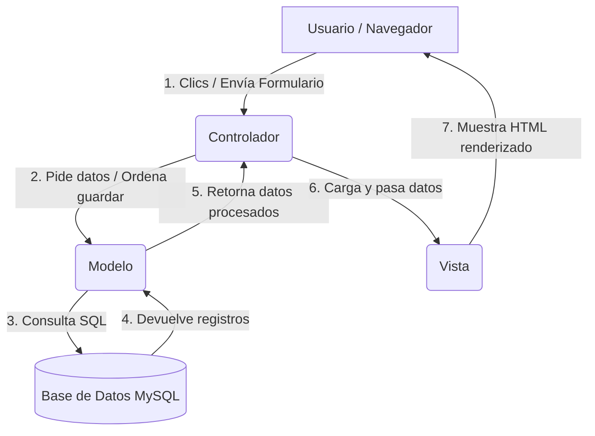
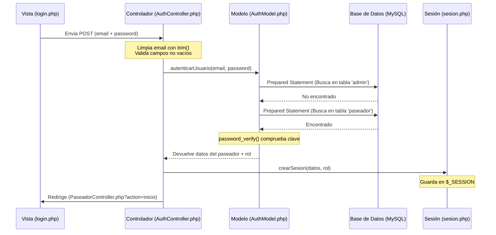

# MANUAL DE EXPLICACIÓN Y FUNCIONAMIENTO - PROYECTO MANADAS
*(Guía de Estudio y Defensa de Proyecto)*

Este documento es una guía explicativa completa sobre el funcionamiento, arquitectura y diseño visual del sistema **Manadas** (MisAnimalitos). Está diseñado tanto para entender el comportamiento de la plataforma como para servir de apoyo ante la defensa del proyecto.

---

## 1. ¿Qué es y qué hace el sistema "Manadas"?
El sistema **Manadas** es una plataforma web desarrollada en **PHP y MySQL** utilizando el patrón de arquitectura **MVC (Modelo-Vista-Controlador)**.
Su propósito principal es servir como un nexo de conexión entre tres tipos de usuarios con roles bien diferenciados:

1.  **Dueños de Mascotas (Usuarios/Clientes):**
    *   Registran sus perfiles y agregan a sus perros (mascotas), ingresando datos como nombre, raza, tamaño y observaciones especiales.
    *   Solicitan y reservan paseos (de tipo individual o grupal) seleccionando la fecha, la hora de inicio y el paseador que prefieran.
    *   Visualizan su historial de reservas, pudiendo controlar si el paseo ya fue pagado y si el servicio ya fue iniciado o completado por el paseador.
2.  **Paseadores (Prestadores de Servicio/Empleados):**
    *   Tienen acceso a su agenda de paseos diarios, que solo muestra aquellos servicios que ya han sido pagados por el cliente y habilitados por el administrador.
    *   Consultan detalles clave para realizar su trabajo: la dirección del dueño, el teléfono de contacto y el nombre del perro.
    *   **Alerta de Comportamiento:** Ven directamente notas sobre el temperamento del animal (ej: "es agresivo con otros machos" o "tiende a escaparse").
    *   Controlan el flujo del paseo en tiempo real mediante botones dinámicos para **Comenzar el Paseo** (cambia el estado a *en curso*) y **Finalizar el Paseo** (cambia el estado a *finalizado*).
3.  **Administrador (Admin):**
    *   Supervisa el funcionamiento integral de la plataforma.
    *   Registra y gestiona las cuentas de los paseadores y dueños.
    *   Revisa el listado global de todos los paseos y pagos realizados en la plataforma.
    *   **Habilitador del Servicio:** Confirma los pagos recibidos (en efectivo, transferencia o tarjeta). Al hacer clic en "Confirmar Pago", el sistema habilita automáticamente el paseo para que el paseador lo visualice en su agenda de trabajo.

---

## 2. Arquitectura de Software: El Patrón MVC
La aplicación está organizada bajo el patrón **Modelo-Vista-Controlador (MVC)**, el cual separa la aplicación en tres capas de responsabilidad lógica para asegurar que el código sea limpio, ordenado, seguro y fácil de mantener:



1.  **Modelo (Models) - "La base de datos y la lógica de datos"**:
    *   *Ubicación:* Carpeta `models/`
    *   *Responsabilidad:* Contiene las clases y métodos encargados de interactuar directamente con la base de datos MySQL. Es el único lugar de la aplicación donde se escriben consultas SQL (`SELECT`, `INSERT`, `UPDATE`, `DELETE`).
    *   *Archivos:* [AuthModel.php](file:///C:/xampp/htdocs/MisAnimalitos/models/AuthModel.php)
2.  **Vista (Views) - "La interfaz gráfica e interactiva"**:
    *   *Ubicación:* Carpeta `views/`
    *   *Responsabilidad:* Es el diseño visual en HTML y CSS que observa el usuario final. Contiene formularios, tablas y tarjetas. Utiliza fragmentos de PHP mínimos (como bucles `foreach` o condicionales `if`) solo para dibujar e imprimir los datos provistos por el controlador.
    *   *Archivos:* [login.php](file:///C:/xampp/htdocs/MisAnimalitos/views/login.php)
3.  **Controlador (Controllers) - "El cerebro del sistema"**:
    *   *Ubicación:* Carpeta `controllers/`
    *   *Responsabilidad:* Es el intermediario. Cuando el usuario hace clic en un botón o envía un formulario, la petición llega a un controlador. Este procesa la lógica inicial, le pide los datos al modelo, los organiza y decide qué vista cargar para mostrarle el resultado final al usuario.
    *   *Archivos:* [AuthController.php](file:///C:/xampp/htdocs/MisAnimalitos/controllers/AuthController.php)

### Estructura de Directorios del Proyecto:
```text
MisAnimalitos/
├── config/                  <-- Parámetros del servidor y sistema global
│   ├── conexion.php         (Establece y cierra la conexión con MySQL mediante la extensión mysqli)
│   ├── config.php           (Define BASE_URL de forma dinámica para evitar enlaces rotos)
│   └── sesion.php           (Inicializa y gestiona las variables de $_SESSION de PHP)
│
├── controllers/             <-- Reciben las acciones de las vistas y coordinan la lógica
│   ├── AdminController.php  (Administración de estadísticas, paseadores, usuarios y pagos)
│   ├── AuthController.php   (Gestiona los flujos de inicio y cierre de sesión)
│   ├── PaseadorController.php(Gestiona la agenda y estados de paseos del paseador)
│   └── UsuarioController.php (Gestiona el registro de perros y solicitudes de paseo de los dueños)
│
├── models/                  <-- Ejecutan las consultas SQL en la base de datos
│   ├── AdminModel.php       (Trae información combinada y confirma pagos mediante transacciones)
│   ├── AuthModel.php        (Autentica usuarios consultando en las tablas de los 3 roles)
│   ├── PaseadorModel.php    (Consulta los paseos asignados y actualiza su estado)
│   └── UsuarioModel.php     (Crea mascotas, solicita paseos y pagos con transacciones)
│
├── views/                   <-- Contienen las interfaces de usuario (HTML/PHP básico)
│   ├── admin/               (Paneles y listas de control del Administrador)
│   ├── paseador/            (Menú de inicio y agenda interactiva del Paseador)
│   ├── usuario/             (Catálogo de mascotas, reservas y formulario de solicitud de paseo)
│   └── partials/            (header.php y footer.php que estructuran el diseño general)
│
├── Assets/                  <-- Archivos estáticos
│   ├── css/                 (new-style.css, contiene las reglas de diseño premium de la app)
│   └── img/                 (Logotipos, fondos estéticos y fotos de perfil de usuarios y perritos)
│
├── index.php                <-- Punto de acceso principal (Redirige al inicio de sesión)
└── manadas.sql              <-- Estructura de tablas y registros iniciales de la base de datos
```

---

## 3. ¿Cómo funciona el Login (Autenticación Paso a Paso)?
El inicio de sesión es el flujo más importante de la aplicación. Comunica de forma lineal todas las capas del MVC y asegura que cada rol aterrice en su panel correspondiente.



### Paso 1: Redirección Inicial
Al escribir la dirección del proyecto en el navegador, el servidor ejecuta [index.php](file:///C:/xampp/htdocs/MisAnimalitos/index.php). Este archivo tiene una sola función de redirección:
```php
header("Location: views/login.php");
exit();
```
Esto le dice al navegador que salte directamente a la página del formulario de login.

### Paso 2: La Pantalla del Login (`views/login.php`)
*   Se muestra una interfaz dividida en dos columnas de aspecto moderno.
*   **Mecanismo de Errores por URL:** Si el controlador de autenticación rechaza al usuario, lo redirige agregando un parámetro en la URL (ej: `login.php?error=credenciales_invalidas`). El código PHP al inicio del formulario detecta este parámetro (`$_GET['error']`) y muestra un mensaje de alerta en rojo ("Email o contraseña incorrectos").
*   El formulario captura el **Email** (`name="email"`) y la **Contraseña** (`name="password"`).
*   Al presionar el botón "Ingresar", los datos se empaquetan y se envían mediante el método **POST** a la URL:
    `controllers/AuthController.php?action=login`

### Paso 3: El Controlador de Autenticación (`controllers/AuthController.php`)
*   Recibe los datos en las variables `$_POST['email']` y `$_POST['password']`.
*   Aplica `trim()` al correo electrónico para eliminar espacios en blanco accidentales al inicio o al final.
*   **Validación de seguridad inicial:** Comprueba si los campos están vacíos. Si el usuario intentó saltarse el formulario enviándolo en blanco, el controlador interrumpe el proceso y lo devuelve al login:
    `Location: views/login.php?error=campos_vacios`
*   Si los campos tienen datos, el controlador crea un objeto de la clase `AuthModel` y le pide autenticar las credenciales llamando al método `autenticarUsuario($email, $password)`.

### Paso 4: El Modelo detective (`models/AuthModel.php`)
*   Dado que los administradores, paseadores y dueños de mascotas tienen atributos muy diferentes, la base de datos cuenta con **3 tablas independientes**: `admin`, `paseador` y `usuarios`.
*   El método `autenticarUsuario` realiza una búsqueda secuencial (en cascada) utilizando la función interna `autenticarEnTabla($email, $password, $tabla)`:
    1.  **Busca en la tabla `admin`:** Si existe un registro con ese email y la clave es correcta, se detiene el proceso y devuelve los datos del administrador indicando el rol `'admin'`.
    2.  **Busca en la tabla `paseador`:** Si no era administrador, busca en la tabla de paseadores. Si coincide, devuelve la información y el rol `'paseador'`.
    3.  **Busca en la tabla `usuarios`:** Si no era ninguno de los anteriores, busca en la tabla de clientes. Si coincide, devuelve la información y el rol `'usuario'`.
*   **Defensa contra Inyecciones SQL (Prepared Statements):** Dentro de cada búsqueda, el email no se concatena directamente en la cadena SQL, sino que se reemplaza por un marcador de posición `?`:
    ```sql
    SELECT * FROM [tabla] WHERE email = ? LIMIT 1
    ```
    PHP se encarga de enviarle a la base de datos el valor de forma aislada a través del comando `$stmt->bind_param('s', $email)`, garantizando que un atacante no pueda inyectar comandos SQL maliciosos en el campo de texto.
*   **Criptografía y Verificación de la Contraseña:** Una vez obtenido el registro que contiene el email del usuario, el modelo llama a la función privada `verificar_password($plain, $stored)`:
    ```php
    return password_verify($plain, $stored) || ($plain === $stored);
    ```
    *   `password_verify` es una función nativa de PHP que toma la contraseña ingresada en texto plano y la compara contra el hash indescifrable (encriptado) de la base de datos (por ejemplo, hashes generados con `bcrypt`).
    *   La comparación estándar `===` se incluye por compatibilidad con contraseñas antiguas de prueba en texto plano que posee la base de datos (ej: la contraseña `1234`).
*   Si la clave es correcta en alguna de las tablas, retorna la fila del usuario, su rol y la columna clave de su ID. Si no se encuentra en ninguna de las tres tablas o la contraseña es inválida, devuelve `null`.

### Paso 5: Creación de la Sesión y Redirección según Rol
*   Si el modelo de autenticación devuelve los datos del usuario, el controlador extrae su ID, su nombre completo (concatenando nombre y apellido) y su foto de perfil.
*   Llama a la función `crearSesion()` (definida en [config/sesion.php](file:///C:/xampp/htdocs/MisAnimalitos/config/sesion.php)), que escribe estos datos en la memoria temporal del servidor:
    ```php
    $_SESSION['email'] = $email;
    $_SESSION['role'] = strtolower($role);
    $_SESSION['user_id'] = $user_id;
    $_SESSION['user_name'] = $name;
    $_SESSION['user_img'] = $img;
    ```
    *Gracias a esta sesión, PHP recuerda que este usuario ya se identificó correctamente y no le vuelve a pedir sus credenciales al navegar por otras páginas internas.*
*   Finalmente, el controlador lee el rol del usuario e indica al navegador a qué página interna debe redirigirse mediante un `switch`:
    *   **Admin:** Redirige a `controllers/AdminController.php?action=inicio`
    *   **Paseador:** Redirige a `controllers/PaseadorController.php?action=inicio`
    *   **Dueño/Usuario:** Redirige a `controllers/UsuarioController.php?action=inicio`

---

## 4. ¿Qué es lo que estás viendo en la pantalla? (La Interfaz Gráfica UI/UX)
La aplicación web utiliza un **Sistema de Diseño Premium** estructurado en Vanilla CSS en el archivo [new-style.css](file:///C:/xampp/htdocs/MisAnimalitos/Assets/css/new-style.css). Este sistema de diseño prioriza la legibilidad, animaciones sutiles e interactividad, empleando conceptos modernos como el **Glassmorphism** (efecto de cristal esmerilado translúcido) y bordes muy redondeados.

### A. La Pantalla de Iniciar Sesión (`login.php`)
Al abrir la página de Login, observas un diseño de pantalla dividida (*Split Screen*):
*   **Panel Izquierdo (Decorativo - 60% del ancho)**: Muestra una gran imagen de fondo de un perro feliz. Sobre la imagen, hay una capa superpuesta con un degradado de violeta vibrante a azul marino oscuro con transparencia, brindando un aspecto elegante. Encima se encuentra un texto limpio: *"Conectando dueños y paseadores de mascotas. Encuentra el paseador perfecto para tu mejor amigo."*
*   **Panel Derecho (Formulario interactivo - 40% del ancho)**: Presenta un fondo blanco e higiénico. Contiene:
    *   El logotipo de la empresa representado por el ícono de una patita (`fas fa-paw`) en color violeta.
    *   Un título con tipografía *Outfit* de Google Fonts: *"Inicia Sesión en tu Cuenta"* y un subtítulo grisáceo *"Bienvenido de nuevo"*.
    *   Los campos de entrada (**Email** y **Contraseña**), los cuales tienen bordes redondeados y un efecto interactivo de foco: al hacer clic sobre ellos, el fondo cambia de gris a blanco, el borde se vuelve violeta y se proyecta una sombra suave de color morado.
    *   El botón **"Ingresar"**, diseñado con un degradado violeta de contraste y bordes redondeados tipo píldora. Cuando pasas el ratón por encima (hover), el botón realiza una micro-animación elevándose sutilmente 3 píes y aumentando su sombra para invitar al clic.
    *   Un enlace que redirige a la creación de cuenta en caso de no poseer una.

### B. El Dashboard del Administrador (`views/admin/inicio.php`)
Es el panel de control exclusivo para el rol de administrador:
*   **Barra de Navegación superior (Header)**: Es una barra flotante que permanece fija en la parte superior. Utiliza una técnica de cristal esmerilado (*backdrop-filter: blur(12px)*) para dejar ver levemente los elementos que pasan por debajo al hacer scroll. Contiene el nombre del sitio, el saludo al usuario logueado ("Hola, Augusto") y un botón rojo estilizado para cerrar sesión.
*   **Banner Héroe**: Un panel superior en color violeta oscuro con un patrón radial abstracto que da la bienvenida al administrador y resume el estado del sitio.
*   **Tarjetas Estadísticas (Grid de 3 Columnas)**: Paneles con fondo semitransparente que se elevan ligeramente y cambian el borde a morado al pasar el ratón por encima. Muestran:
    *   **Tarjeta Paseadores:** Muestra el número total de paseadores activos en el sistema en una tipografía gigante con degradado, junto a un botón de "Gestionar".
    *   **Tarjeta Dueños/Clientes:** Muestra la cantidad total de usuarios registrados y un acceso directo para verlos en detalle.
    *   **Tarjeta Paseos Activos:** Presenta en un degradado naranja de alerta la cantidad de solicitudes que aún no han sido finalizadas, permitiendo acceder al listado general de pedidos.

### C. El Dashboard del Dueño de Mascota (`views/usuario/inicio.php`)
Ofrece al cliente una experiencia amigable y directa:
*   **Tarjeta "🐶 Mis Mascotas":** Accede al catálogo de perros registrados del usuario.
*   **Tarjeta "📅 Pedir Paseo" (Destacada):** Posee un borde violeta de realce y un botón verde brillante de *"Solicitar Ahora"* para guiar al usuario a realizar su pedido.
*   **Tarjeta "📋 Mis Reservas":** Permite visualizar el listado histórico de los paseos solicitados y su respectivo estado de pago.

### D. La Agenda de Paseos del Paseador (`views/paseador/agenda.php`)
Muestra en una cuadrícula interactiva las tarjetas de los paseos asignados que ya fueron habilitados:
*   **Cabecera de Tarjeta:** Muestra la fecha del paseo con un ícono de calendario y la hora exacta de inicio con un ícono de reloj dentro de un fondo redondeado de color gris claro.
*   **Datos Clave:** Presenta el nombre y raza del perro junto a los datos del dueño (nombre, dirección de recogida y teléfono para contactarlo).
*   **⚠️ Cuadro de Alerta (Observaciones):** Si el perro tiene indicaciones especiales (por ejemplo: *"Es nervioso con otros perros"* o *"Usa bozal obligado"*), se dibuja un recuadro de color amarillo con borde naranja e ícono de advertencia para garantizar la seguridad del paseador.
*   **Botones de Estado en Tiempo Real:**
    *   Si el paseo no se ha iniciado: Muestra un botón azul de **"▶️ Comenzar Paseo"**.
    *   Si el paseo ya comenzó: El botón cambia automáticamente a color verde degradado y dice **"✅ Finalizar Paseo"**.
    *   Si el paseo ya terminó: Se ocultan los botones y se dibuja una etiqueta verde que dice **"¡Paseo Completado! 🎉"**.

---

## 5. Conceptos Avanzados de Programación y Base de Datos (Preguntas de Examen)
A continuación se detallan los conceptos que habitualmente evalúan los profesores en exámenes y defensas de código:

### 1. Transacciones en MySQL (Begin Transaction, Commit y Rollback)
Una transacción agrupa dos o más operaciones SQL de forma que se ejecuten todas o ninguna. Esto evita inconsistencias de datos si ocurre un fallo eléctrico o un error en la mitad de un proceso.
*   **Ejemplo en Solicitud de Paseos ([UsuarioModel.php:L65](file:///C:/xampp/htdocs/MisAnimalitos/models/UsuarioModel.php#L65)):**
    Al pedir un paseo, se debe registrar el paseo (tabla `paseo`) y generar su boleta de cobro inicial (tabla `pago`).
    1.  Se detiene la auto-grabación de MySQL: `$this->conn->begin_transaction()`.
    2.  Se inserta el paseo.
    3.  Se obtiene el ID del paseo recién creado: `$this->conn->insert_id`.
    4.  Se inserta el cobro en la tabla de pagos asignándole el ID del paseo anterior.
    5.  Si ambas inserciones funcionan, se consolidan los datos: `$this->conn->commit()`. Si algo falla (ej. base de datos saturada), se descarta todo: `$this->conn->rollback()`, evitando que existan paseos huérfanos sin facturación.
*   **Ejemplo en Confirmación de Pagos ([AdminModel.php:L74](file:///C:/xampp/htdocs/MisAnimalitos/models/AdminModel.php#L74)):**
    Cuando el administrador confirma un pago, la transacción actualiza el estado del cobro en la tabla `pago` a `'confirmado'` y, al mismo tiempo, modifica el estado de habilitación en la tabla `paseo` a `'habilitado_admin'`. Ambas tablas deben actualizarse de manera simultánea para que el paseo aparezca de inmediato en la agenda del paseador.

### 2. Prepared Statements (Consultas Preparadas)
Es una técnica de seguridad que separa el código SQL de los valores que ingresa el usuario. Evita los ataques de **Inyección SQL**, donde un hacker escribe código de base de datos en los formularios para robar o destruir información.
*   *Código de ejemplo en [PaseadorModel.php:L50](file:///C:/xampp/htdocs/MisAnimalitos/models/PaseadorModel.php#L50):*
    ```php
    $sql = "UPDATE paseo SET estado_paseo = ? WHERE id_paseo = ? AND id_paseador = ?";
    $stmt = $this->conn->prepare($sql);
    $stmt->bind_param("sii", $nuevo_estado, $id_paseo, $id_paseador);
    $stmt->execute();
    ```
    Los signos `?` actúan como contenedores vacíos. Con `bind_param("sii", ...)`, le indicamos a MySQL que los valores son un String (cadena de texto) y dos Integers (números enteros). El motor de base de datos trata a estas variables estrictamente como datos, neutralizando cualquier intento de inyección de comandos SQL.

### 3. Consultas Multitabla (JOINs)
Permite extraer información distribuida en varias tablas relacionadas.
*   *Código de ejemplo en [AdminModel.php:L50](file:///C:/xampp/htdocs/MisAnimalitos/models/AdminModel.php#L50):*
    Para pintar la tabla de pedidos, el administrador necesita información de 5 tablas distintas. Se utiliza un `LEFT JOIN` partiendo de la tabla `paseo` (`pa`), asociando la tabla `pago` (`pg`), la mascota (`m`), el dueño de la mascota (`u`) y el paseador asignado (`pas`). De esta manera, con una sola consulta a la base de datos se consolida toda la información en la pantalla del administrador.

### 4. Sesiones en HTTP (Protocolo sin estado)
El protocolo HTTP es "stateless" (sin memoria). Cada clic de un usuario abre una conexión nueva e independiente de la anterior.
*   **Solución:** Se utiliza la variable superglobal de PHP `$_SESSION`. Al loguearse, el servidor le asigna una cookie temporal de identificación al navegador (`PHPSESSID`). Cuando el navegador realiza un nuevo clic, le envía esta cookie al servidor. PHP busca el archivo asociado en el servidor y recupera los datos almacenados (como el ID del usuario y su rol).
*   **Seguridad:** En todos los controladores, al inicio, se manda a llamar a la función `require_login()` y se verifica con `get_user_role()` si el rol coincide con el permitido. Si un usuario intenta escribir directamente la URL del administrador (ej: `views/admin/inicio.php`), PHP detecta que no tiene permisos y lo expulsa automáticamente al Login.

---
